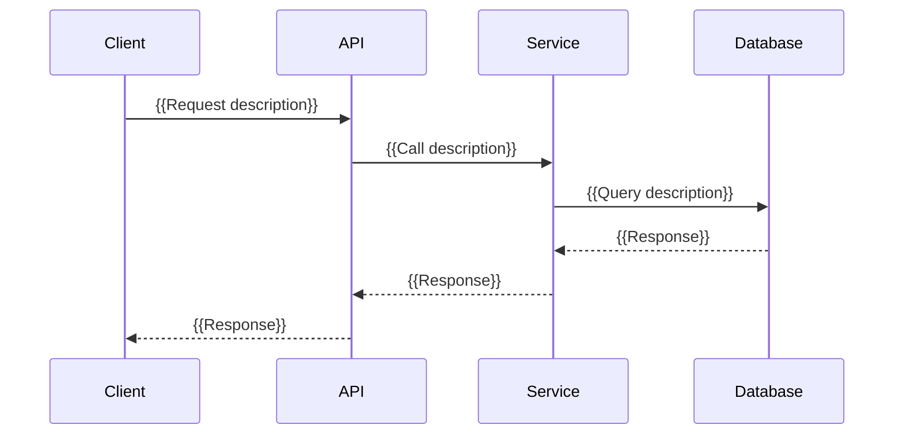

## Context

**Problem**: {{One sentence: what problem this system or component solves.}}
**System boundary**: {{What is inside this design vs. what is external.}}

## Component Diagram

```mermaid
flowchart TD
  Client[Client] --> API[API Layer]
  API --> SVC[{{Service}}]
  SVC --> DB[(Database)]
  SVC --> EXT[External Service]
```

## Components

| Component | Responsibility | Interface |
|-----------|---------------|-----------|
| {{Name}} | {{Single-sentence responsibility}} | {{HTTP / RPC / event / import}} |
| {{Name}} | {{Single-sentence responsibility}} | {{HTTP / RPC / event / import}} |
| {{Name}} | {{Single-sentence responsibility}} | {{HTTP / RPC / event / import}} |

## Data Flow



### Flow Steps (prose)

1. {{Step 1 — actor → action → target}}
2. {{Step 2}}
3. {{Step 3}}

## Decisions

### Decision 1: {{Topic}}

**Chosen**: {{Option chosen.}} **Rationale**: {{Why, max 2 sentences.}}
**Alternatives considered**: {{Option A}}, {{Option B}}

### Decision 2: {{Topic}}

**Chosen**: {{Option chosen.}} **Rationale**: {{Why, max 2 sentences.}}
**Alternatives considered**: {{Option A}}, {{Option B}}

## Non-Functional Requirements

| Quality | Target | Notes |
|---------|--------|-------|
| Latency | {{e.g. p99 < 200ms}} | {{context}} |
| Availability | {{e.g. 99.9%}} | {{context}} |
| Scalability | {{e.g. 10k req/s}} | {{context}} |
| Security | {{e.g. OAuth2, mTLS}} | {{context}} |

## Open Questions

| # | Question | Owner | Due |
|---|----------|-------|-----|
| 1 | {{Question}} | {{owner}} | {{date or "—"}} |
