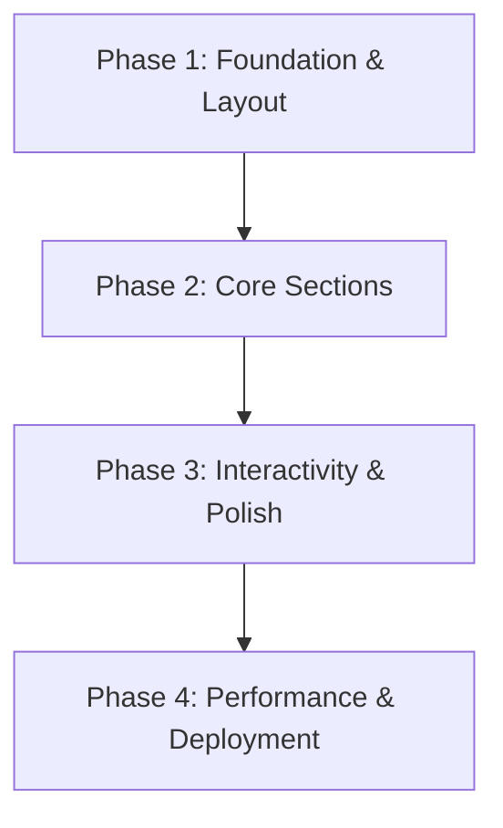

## Goal

Build a polished, performant developer portfolio website using Next.js 16 (App Router), React 19, and Tailwind CSS 4 that showcases projects, skills, and professional experience with dark mode support, responsive design, and optimized performance.

## Constraints

- Next.js 16 with App Router — server components by default
- Tailwind CSS 4 for all styling — no CSS-in-JS; class-based dark mode via `@custom-variant dark (&:where(.dark, .dark *))`
- TypeScript strict mode
- Biome for linting and formatting
- React Compiler enabled (`reactCompiler: true`)
- Deploy to Vercel; use ISR where beneficial
- Resend for contact form email delivery
- Existing assets in `public/assets/` (portrait images, favicon set, background video)

## Out of Scope

- CMS integration (content lives in code/local data files)
- Blog functionality (can be a future phase)
- Authentication or user accounts
- Backend API routes beyond contact form
- Analytics dashboard

## Phase Diagram

## Phases

### Phase 1: Foundation & Layout

**Goal**: Establish the design system, global layout, navigation, and shared components.
**Dependencies**: none
**Status**: ✅ Complete

| #   | Step                                                                                                                                                                                                                             | Owner | Output                                              |
| --- | -------------------------------------------------------------------------------------------------------------------------------------------------------------------------------------------------------------------------------- | ----- | --------------------------------------------------- |
| 1.0 | Install dependencies — `zod`, `resend`                                                                                                                                                                                       | Dev   | Dependencies ready                                  |
| 1.1 | Define color palette, typography tokens, and spacing scale in [src/app/globals.css](../src/app/globals.css) — add `@custom-variant dark (&:where(.dark, .dark *))` for class-based dark mode; include toggle logic in layout | Dev   | Updated CSS with design tokens for light/dark modes |
| 1.2 | Update [src/app/layout.tsx](../src/app/layout.tsx) — metadata (title, description, OG tags), configure Fraunces display font + Geist; add `favicon.ico` via `src/app/icon.tsx`, `site.webmanifest`, and OG image              | Dev   | SEO-ready root layout with favicon + OG image       |
| 1.3 | Create `src/components/header.tsx` — sticky nav with name/logo, section links, dark mode toggle, **mobile hamburger menu + drawer** (core layout, not deferred)                                                             | Dev   | Responsive header with mobile nav                   |
| 1.4 | Create `src/components/footer.tsx` — social links (GitHub, LinkedIn, email), copyright                                                                                                                                       | Dev   | Footer component                                    |
| 1.5 | Create `src/components/section-container.tsx` — reusable wrapper for consistent section spacing and max-width                                                                                                                | Dev   | Layout primitive                                    |
| 1.6 | Create `src/lib/data.ts` — typed data file for all portfolio content using `satisfies` for type-safe content without widening                                                                                                | Dev   | Single source of truth for content                  |

### Phase 2: Core Sections

**Goal**: Implement all major content sections of the single-page portfolio.
**Dependencies**: Phase 1 complete

| #   | Step                                                                                                                                                                                  | Owner | Output                          |
| --- | ------------------------------------------------------------------------------------------------------------------------------------------------------------------------------------- | ----- | ------------------------------- |
| 2.1 | **Hero section** in [src/app/page.tsx](../src/app/page.tsx) — portrait image (`Gagik-portrait-250px.jpg`), name, title, short bio, CTA buttons (resume download, contact)        | Dev   | Above-the-fold hero             |
| 2.2 | **About section** — `src/components/sections/about.tsx` — expanded bio; background video loaded with `<video autoplay muted loop playsinline preload="none">` to protect 3G perf | Dev   | About section                   |
| 2.3 | **Skills section** — `src/components/sections/skills.tsx` — categorized skill grid with icons or visual indicators; build hover/focus states inline                               | Dev   | Skills display                  |
| 2.4 | **Projects section** — `src/components/sections/projects.tsx` — card grid with image, title, description, tech tags, links; build hover/focus states inline                      | Dev   | Project showcase                |
| 2.5 | **Experience section** — `src/components/sections/experience.tsx` — timeline or card layout for work history                                                                      | Dev   | Experience timeline             |
| 2.6 | **Contact section** — `src/components/sections/contact.tsx` — contact form (name, email, message) with client-side Zod validation, social links                                  | Dev   | Contact form UI                 |
| 2.7 | **Contact API route** — `src/app/api/contact/route.ts` + Resend integration; share Zod schema between client and API; test end-to-end                                            | Dev   | Working contact form submission |

### Phase 3: Interactivity & Polish

**Goal**: Add animations, transitions, accessibility, and visual refinements.
**Dependencies**: Phase 2 complete

| #   | Step                                                                                                                                                          | Owner | Output                          |
| --- | ------------------------------------------------------------------------------------------------------------------------------------------------------------- | ----- | ------------------------------- |
| 3.1 | Add scroll-based reveal animations — **prefer CSS `@starting-style` + `animation-timeline: view()`** over framer-motion (React Compiler compatibility risk) | Dev   | Smooth section transitions      |
| 3.2 | Implement smooth-scroll navigation from header links to sections                                                                                              | Dev   | In-page navigation              |
| 3.3 | Accessibility audit — semantic HTML, ARIA labels, keyboard navigation, color contrast checks                                                                  | Dev   | WCAG 2.1 AA compliance          |
| 3.4 | Mobile responsiveness QA pass — test breakpoints (sm, md, lg, xl)                                                                                            | Dev   | Fully responsive across devices |
| 3.5 | Create `src/app/not-found.tsx` — styled 404 page consistent with design system                                                                               | Dev   | Polished 404 experience         |

### Phase 4: Performance & Deployment

**Goal**: Optimize bundle size, images, and Core Web Vitals; deploy to production.
**Dependencies**: Phase 3 complete

| #   | Step                                                                                                          | Owner | Output                        |
| --- | ------------------------------------------------------------------------------------------------------------- | ----- | ----------------------------- |
| 4.1 | Optimize images with `next/image` — proper `sizes`, `priority` on hero, WebP/AVIF formats               | Dev   | Optimized image delivery      |
| 4.2 | Add structured data (JSON-LD) for person schema                                                               | Dev   | SEO structured data           |
| 4.3 | Generate `sitemap.xml`, `llm.txt`, and `robots.txt` via Next.js metadata API                             | Dev   | Search engine discoverability |
| 4.4 | Run Lighthouse audit — target 95+ on all categories                                                          | Dev   | Performance baseline          |
| 4.5 | Configure **Vercel** deployment — set up domain, environment variables (e.g. `RESEND_API_KEY`)           | Dev   | Production deployment         |
| 4.6 | Set up GitHub Actions CI — run `biome check`, `tsc --noEmit`, and `next build` on every push to `main` | Dev   | Automated quality gate        |

## Verification

- [ ] Site loads under 2s on 3G throttled connection
- [ ] Lighthouse scores: Performance 95+, Accessibility 95+, Best Practices 95+, SEO 95+
- [ ] All sections render correctly on mobile (375px), tablet (768px), and desktop (1440px)
- [ ] Dark mode toggles correctly and persists across page reloads with no flash
- [ ] All navigation links scroll to correct sections smoothly
- [ ] Contact form validates input and shows success/error states
- [ ] Contact form sends email successfully via Resend
- [ ] All images use `next/image` with appropriate sizing
- [ ] No TypeScript errors (`tsc --noEmit` passes)
- [ ] Biome lint and format checks pass
- [ ] Portrait images and favicon render correctly from `public/assets/`
- [ ] `favicon.ico` loads correctly and OG image renders in social media previews
- [ ] CI pipeline passes on push to `main`

## Open Questions

| # | Question                                                                                          | Owner | Due |
| - | ------------------------------------------------------------------------------------------------- | ----- | --- |
| 1 | Which projects should be featured? Need titles, descriptions, screenshots, and repo URLs          | Gagik | —  |
| 2 | Resume PDF — should it be hosted in `public/` or linked externally?                            | Gagik | —  |
| 3 | Custom domain name for deployment?                                                                | Gagik | —  |
| 4 | Any specific design inspiration or color scheme preference beyond the existing dark/light tokens? | Gagik | —  |
| 5 | Resend account — does one already exist, or does it need to be created?                          | Gagik | —  |
